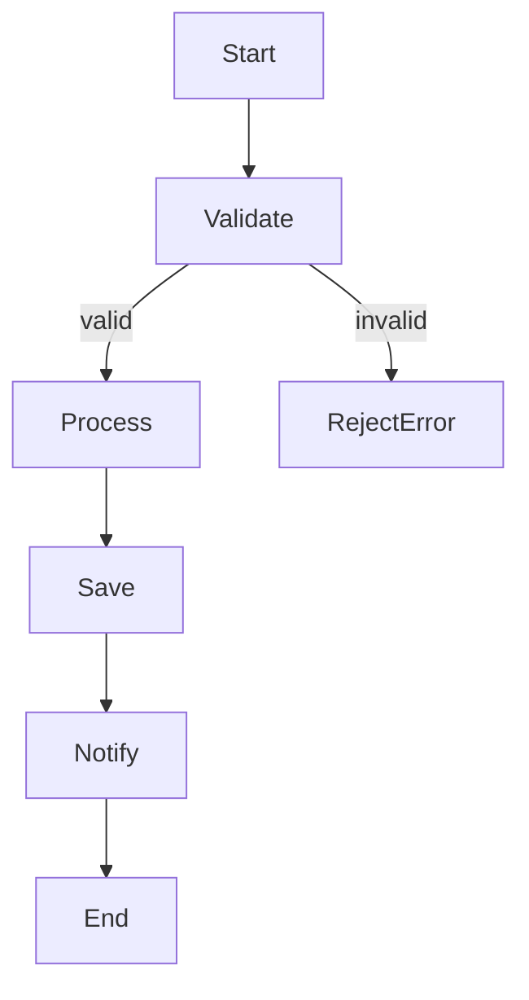
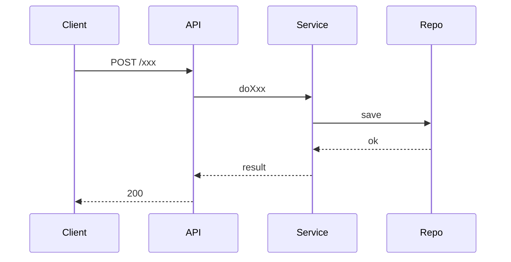

# Skill: Writing Detail Design Document (DDD)

## When to use
- Stage 3, **after BD is in place** (or in parallel).
- When another engineer must be able to implement just by reading the DDD.

## Purpose
- **Audience**: engineers (implementer, reviewer, future-you).
- **Answers**: How will we implement? API contract? Schema? Errors? Tests? Rollout?
- DDD is the **single source of truth** for implementation. Code drift from DDD → bug or DDD needs update.

## Required structure

### 1. Header
```yaml
Title: DDD — <feature>
Status: DRAFT | REVIEW | FINAL
Linked BD: <path>
Impact: 🟢/🟡/🟠/🔴
```

### 2. API Contract
For each new/changed endpoint:
- Method + path
- Request schema (JSON / proto) + example
- Response schema + example (success and error)
- Error codes table:

| Code | HTTP Status | When | User-facing message |
|---|---|---|---|
| `EMPTY_INPUT` | 400 | input is empty | "Email is required" |

### 3. Data Model & Schema Changes
- **Mandatory if schema changes**: 1 Mermaid `erDiagram`.
- Migration plan: DDL up + down, data to backfill.
- Backward compat strategy (e.g. dual-write for N days).

### 4. Diagrams (mandatory)

#### 4a. Logical processing flowchart
A Mermaid `flowchart` showing the algorithm and decision branches.



#### 4b. Sequence — happy path


#### 4c. Sequence — error path
At least one for the most likely / highest-impact error scenario.

### 5. Algorithms / Business Rules
- Pseudocode or step-by-step for every non-trivial rule.
- Big-O for hot paths.

### 6. Error Handling & Edge Cases
Complete table — each edge case has expected behavior.

### 7. Performance Budget
- Latency p50 / p95 / p99 targets.
- Throughput.
- Memory / CPU budget if relevant.

### 8. Security Considerations
- Brief threat model (STRIDE).
- Auth/authz per endpoint.
- Input validation rules.
- PII handling.
- Rate limiting.

### 9. Test Plan
| Layer | # tests | Coverage target | Notes |
|---|---|---|---|
| Unit | ~15 | ≥85% | branches of business rules |
| Integration | ~5 | — | with real DB + external mocks |
| E2E | 2 | — | happy + 1 error path |

### 10. Rollout Plan
- Feature flag name + default state.
- Canary %: 1% → 10% → 50% → 100%.
- Rollback steps (concrete, executable during a panic).

### 11. Telemetry / Observability
- Metrics: name, type (counter / histogram), labels, alert threshold.
- Logs: which events, level, fields.
- Traces: spans to add.

### 12. Decision Log
| Date | Decision | Rationale |
|---|---|---|

### 13. Risks & Mitigations
Carry over from Stage 2 grooming + new risks discovered while writing DDD.

## Writing rules
- Quantitative > qualitative. "Fast" ❌ → "p95 ≤ 200ms" ✅.
- All assumptions explicit.
- Every decision has a rationale.
- Diagram > prose when possible.
- Tri-lingual: EN canonical + VI + JP per section.

## Anti-patterns
- DDD without sequence diagrams.
- DDD without error codes table.
- DDD without rollback plan.
- DDD containing "TBD" / "I'm not sure" — must resolve before FINAL.
- API contract without examples.
