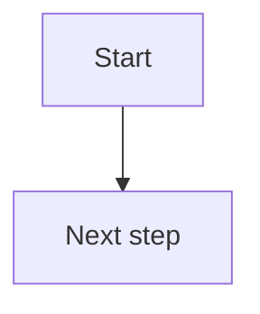
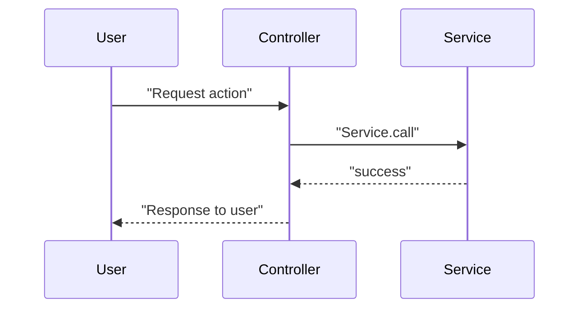
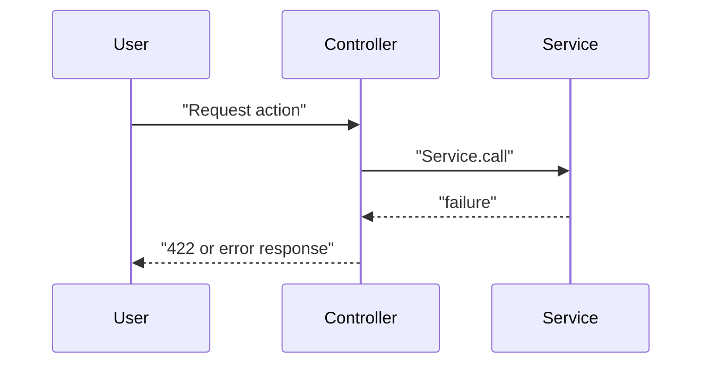

# DDD: <Tên feature> — ai-housemaker

| Thuộc tính | Giá trị |
|---|---|
| **Trạng thái** | DRAFT |
| **Task** | No.XX |
| **BD** | `docs/specs/<YYYY-MM-DD>-<slug>.md` |
| **Figma** | file key + node id (nếu có) |
| **Mức ảnh hưởng** | 🟢 / 🟡 / 🟠 / 🔴 |
| **Tạo** | YYYY-MM-DD |
| **Canonical EN** | `docs/ddd/<YYYY-MM-DD>-<slug>.md` |

> **Nguồn sự thật cho implementation.** Code lệch DDD = bug hoặc phải cập nhật DDD.
> Bản tiếng Việt này dùng cho Notion / review nội bộ. Canonical EN: `docs/ddd/<same-slug>.md`.

**Format:** prose kiểu no.82 — đoạn mở đầu + bullet path/behavior + subsection `### **N. ...**` + "Lý do" / "Không làm" inline. Gap gộp vào cuối **Hiện trạng dự án**.

---

## **Phạm vi và mục tiêu**

Task `no.XX` [một đoạn mô tả user làm được gì sau khi ship — không copy ticket nguyên văn].

In scope:

- ...

Out of scope:

- ...

**Phase goal:** [Một câu — sau khi ship, user/system đạt được gì?]

---

## **Hiện trạng dự án**

[Màn hình / module] đã tồn tại:

- route ... tại `config/routes.rb`
- controller ... tại `app/controllers/...`
- view ... tại `app/views/...`
- service/query ... tại `app/services/...` hoặc `app/queries/...`

Current behavior:

- ...
- ...

Các pattern UI có thể tái sử dụng:

- ... tại `app/views/...` — [ghi chú ngắn]
- Stimulus/Turbo helpers tại `app/javascript/controllers/...` (nếu có)

Gap lớn nhất so với `no.XX`:

- chưa có ...
- chưa khớp Figma ...
- chưa có test ...

---

## **Thiết kế dữ liệu**

**Migration:** Có / Không

### **1. `<table_name>`**

Current schema tại `app/models/...` và `db/schema.rb`:

- ...

Thiết kế mới cho `no.XX`:

- ...

| Label UI (JA) | Cột DB | Form attribute | Validation |
|---|---|---|---|
| ... | ... | ... | ... |

Lý do [quyết định mapping / không migration]:

- ...

### **2. `<table_name>`** (nếu có thêm entity)

...

---

## **Thiết kế model / domain**

### **1. `<Model>` hoặc service layer**

Trách nhiệm domain trong `no.XX`:

- ...

```ruby
# ví dụ service call — giữ nguyên hoặc mô tả thay đổi
XxxManager::Yyy.call(...)
```

### **2. Quyết định domain**

**[Tên quyết định]**

- Lý do: ...
- Không làm: ...

### **3. Form objects** (nếu có)

**`Namespace::XxxForm`** — attributes; validation.

Param keys / strong params:

```ruby
params.require(:xxx_form).permit(...)
```

---

## **Thiết kế controller / form**

### **1. Routes**

```ruby
# config/routes.rb
```

| HTTP | Path | Action | Ghi chú |
|---|---|---|---|
| GET | ... | ... | ... |

### **2. `<Controller>#<action>`**

Responsibility:

- ...

Behavior:

```ruby
# pseudocode nhánh chính
```

Response:

- success: ...
- 422: ...
- failure: ...

### **3. `<Controller>#<action>`** (lặp cho từng controller mới)

...

### **4. Rename map** (nếu có)

| Cũ | Mới |
|---|---|
| ... | ... |

---

## **Thiết kế view và pattern UI**

### **1. Cấu trúc file**

```
app/views/...
```

### **2. Cấu trúc màn hình**

```
dashboard_page_shell / wireframe text
├── ...
└── ...
```

### **3. Layout**

- Layout: `layouts/dashboard` (không dùng `layouts/auth` trừ login/404)
- Class: `ahm-card`, `ahm-modal-*`, `ahm-detail-kv-*`

---

## **HTTP response và xử lý lỗi**

| Endpoint | Thành công | 422 form | Service fail |
|---|---|---|---|
| ... | ... | ... | ... |

Edge cases:

| # | Tình huống | Hành vi |
|---|---|---|
| 1 | ... | ... |

---

## **Thiết kế i18n và messages**

Locale hiện có liên quan ở:

- `config/locales/ja.yml`
- `config/locales/en.yml`

Reuse hiện có:

- ...

Cần bổ sung cho `no.XX`:

- namespace `...` — keys flash, modal, field labels
- UI user-facing: **JA**; không hardcode EN trong view mới

---

## **Bảo mật và tenant isolation**

### **1. Tenant scoping / auth**

Mọi lookup phải đi qua:

- `policy_scope(...)` / `current_tenant_user` / ...

### **2. Authorization**

Các action mới cần authorize rõ:

- `index?`, `show?`, `update_note?`, ...

Không gộp quyền khác nhau vào một method policy mơ hồ nếu nghiệp vụ khác nhau.

### **3. Cross-tenant prevention**

- ...

### **4. CSRF / error exposure**

- CSRF: Rails default
- Không expose raw service error — dùng i18n

---

## **Observability**

`no.XX` có thêm metric/alert mới không: Có / Không.

Audit qua service + `AuditLog` khi có `actor` + `request_id`. Rails request log đủ hay không — ghi rõ.

---

## **Sơ đồ**

> **Notion:** Mermaid block phải bọc message trong dấu `"..."`; tránh `;`, `:`, `?`, `/` trong label; participant alias không dùng khoảng trắng hoặc `::`.

### Flowchart logic



### Sequence — happy path



### Sequence — error path



---

## **Thứ tự triển khai và rollback**

0. ...
1. ...

**Rollback:** git revert; migration down (nếu có)

---

## **Test design (RSpec)**

### **Coverage đã có**

Đã kiểm tra có coverage hiện hữu cho:

- ...

Coverage này phản ánh current state: ...

### **Coverage cần bổ sung cho `no.XX`**

Request specs:

- ...

Form / policy / service specs:

- ...

---

## **Bảng ánh xạ requirement**

| Yêu cầu (Figma / PO / ticket) | Section | Test |
|---|---|---|
| ... | ... | T... |

---

## Changelog

- YYYY-MM-DD — Created (DRAFT)
