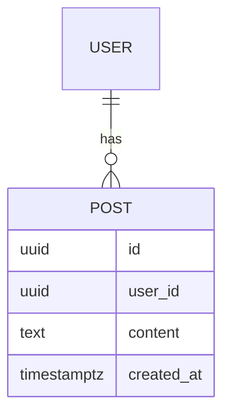
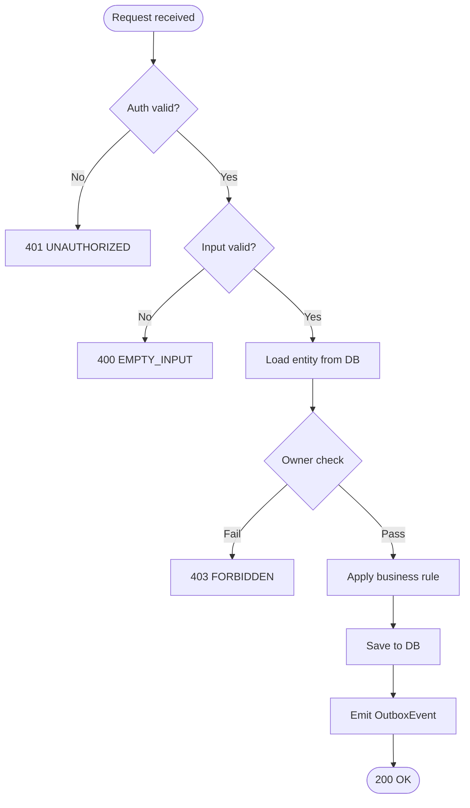
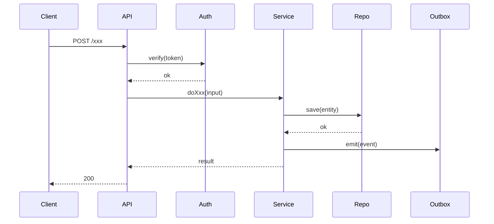
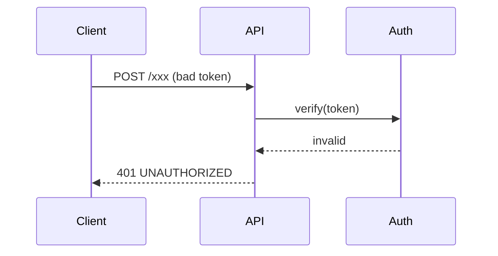

# DDD: <Feature Name>

- **Status**: DRAFT
- **Linked BD**: [docs/specs/...](../specs/...)
- **Impact**: 🟢 / 🟡 / 🟠 / 🔴
- **Created**: <YYYY-MM-DD>

> **Tri-lingual rule**: Textual sections appear in 3 languages — EN (canonical) + VI + JP in collapsible blocks. Code, tables, and diagrams are language-neutral.

---

## 1. API Contract

### `POST /xxx`

**Request:**
```json
{
  "field": "value"
}
```

**Response 200:**
```json
{ "id": "123", "createdAt": "2026-06-16T00:00:00Z" }
```

**Error codes:**
| Code | HTTP | When | User message |
|---|---|---|---|
| `EMPTY_INPUT` | 400 | input is empty | "Input is required" |
| `UNAUTHORIZED` | 401 | missing token | "Please sign in" |
| `UPSTREAM_FAILED` | 502 | external API failed | "Service unavailable, retry" |

---

## 2. Data Model & Schema Changes

### ERD (mandatory if schema changes)



### Migration

**Up:**
```sql
ALTER TABLE posts ADD COLUMN status TEXT NOT NULL DEFAULT 'draft';
CREATE INDEX idx_posts_status ON posts(status);
```

**Down:**
```sql
DROP INDEX idx_posts_status;
ALTER TABLE posts DROP COLUMN status;
```

**Backfill:** N/A (default value sufficient).

---

## 3. Diagrams (mandatory)

### 3a. Logical processing flowchart



### 3b. Sequence — happy path



### 3c. Sequence — error path (invalid token)



---

## 4. Algorithms / Business Rules

### Rule: <name>
```
INPUT: ...
1. validate input
2. if X then Y else Z
3. ...
OUTPUT: ...
Big-O: O(n)
```

---

## 5. Error Handling & Edge Cases

| # | Edge case | Expected behavior |
|---|---|---|
| 1 | Empty input | 400 `EMPTY_INPUT` |
| 2 | Concurrent submit | idempotency key required, 2nd request → 200 with same id |
| 3 | Upstream timeout | 502 `UPSTREAM_FAILED`, log + retry once |

---

## 6. Performance Budget

- p50 ≤ 80ms
- p95 ≤ 200ms
- p99 ≤ 500ms
- Throughput: 100 RPS sustained

---

## 7. Security Considerations

**EN** (canonical):
- **AuthZ**: only owner can modify own resource.
- **Input validation**: max length 1000 chars, no HTML.
- **Rate limit**: 10 req/min/user.
- **PII**: ...
- **OWASP relevant**: Injection (SQL), Broken Access Control.

<details><summary>🇻🇳 Tiếng Việt</summary>

- **Phân quyền**: chỉ owner mới sửa được resource của mình.
- **Validate input**: tối đa 1000 ký tự, không HTML.
- **Rate limit**: 10 req/phút/user.
- **PII**: ...
- **OWASP liên quan**: Injection (SQL), Broken Access Control.

</details>

<details><summary>🇯🇵 日本語</summary>

- **認可 (AuthZ)**: 所有者のみが自分のリソースを変更可能。
- **入力バリデーション**: 最大 1000 文字、HTML 不可。
- **レート制限**: 10 req/分/ユーザー。
- **PII**: ...
- **関連 OWASP**: Injection (SQL), Broken Access Control。

</details>

---

## 8. Test Plan

| Layer | # tests | Coverage | Notes |
|---|---|---|---|
| Unit | 12 | ≥85% | branches of business rules |
| Integration | 4 | — | with real DB + mocked external |
| E2E | 2 | — | happy + 1 error path |

---

## 9. Rollout Plan

- **Feature flag**: `feature.xxx.enabled` (default: `false`)
- **Canary**: 1% (1 day) → 10% (1 day) → 50% (1 day) → 100%
- **Rollback steps**:
  1. Toggle flag `feature.xxx.enabled = false`.
  2. If schema issue: run migration `down`.
  3. If data corruption: restore from snapshot at <time>.

---

## 10. Telemetry / Observability

- **Metrics**:
  - `xxx.requests` (counter, labels: status, error_code) — alert > 5% error rate.
  - `xxx.latency` (histogram) — alert p95 > 300ms.
- **Logs**: `xxx.start`, `xxx.success`, `xxx.failure` (level: info / warn / error).
- **Traces**: span `xxx.handle` wrapping the full handler.

---

## 11. Decision Log

| Date | Decision | Rationale |
|---|---|---|

---

## 12. Risks & Mitigations

| Risk | Likelihood | Impact | Mitigation |
|---|---|---|---|
| ... | ... | 🟠 | ... |

---

## Changelog

- <YYYY-MM-DD> — Created (DRAFT)
