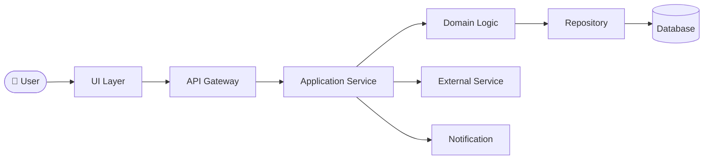

# BD: <Feature Name>

- **Status**: DRAFT
- **Owner**: <author>
- **Stakeholders**: <PO, tech lead, ...>
- **Linked task**: <Jira / Linear / GitHub issue>
- **Impact**: 🟢 / 🟡 / 🟠 / 🔴
- **Created**: <YYYY-MM-DD>

> **Tri-lingual rule**: Every textual section below is duplicated in 3 languages — EN (canonical, top), VI and JP in collapsible blocks. Code blocks, tables, diagrams are language-neutral and not duplicated.

---

## 1. Background & Why

**EN** (canonical):
<Current situation + user/business pain points.>
<Business goal — measurable.>
<Why prioritize now.>

🇻🇳 Tiếng Việt

<Tình huống hiện tại + vấn đề user/business gặp phải.>
<Mục tiêu kinh doanh — số đo cụ thể.>
<Lý do prioritize bây giờ.>

🇯🇵 日本語

<現状 + ユーザー / ビジネスが抱えている課題。>
<ビジネス目標 — 計測可能な指標。>
<なぜ今優先するか。>

---

## 2. Goals & Non-goals

**EN** (canonical):
**Goals**
- ...

**Non-goals** (critical to prevent scope creep)
- ...

🇻🇳 Tiếng Việt

**Goals (Mục tiêu)**
- ...

**Non-goals (Không làm)** — quan trọng để chống scope creep
- ...

🇯🇵 日本語

**Goals (目標)**
- ...

**Non-goals (対象外)** — スコープクリープを防ぐために重要
- ...

---

## 3. User Stories

**EN** (canonical):
- As a `<role>`, I want `<action>`, so that `<benefit>`.
  - High-level acceptance criteria: ...

🇻🇳 Tiếng Việt

- Là một `<role>`, tôi muốn `<hành động>`, để `<lợi ích>`.
  - Tiêu chí chấp nhận cao cấp: ...

🇯🇵 日本語

- `<role>` として、 `<benefit>` のために `<action>` をしたい。
  - 受け入れ基準 (高レベル): ...

---

## 4. High-level Solution

**EN** (canonical):
<2–3 paragraphs describing the approach.>

🇻🇳 Tiếng Việt

<2–3 đoạn mô tả approach.>

🇯🇵 日本語

<アプローチを 2〜3 段落で説明。>

### 🎨 Processing flow diagram (mandatory)

> Replace with the actual flow for this feature. Show: actors, components, data direction, key external integrations.

---

## 5. Affected Components

| Component | Type of change | Risk |
|---|---|---|
| `module-a` | Modify | 🟡 |
| `module-b` | New | 🟢 |
| `module-c` | Breaking | 🟠 |

---

## 6. Alternatives Considered

| Option | Description | Why not chosen |
|---|---|---|
| A | ... | ... |
| B | ... | ... |

---

## 7. Open Questions

**EN**:
1. ...
2. ...

🇻🇳 Tiếng Việt

1. ...
2. ...

🇯🇵 日本語

1. ...
2. ...

---

## 8. Assumptions

- ...

---

## 9. Decision Log

| Date | Decision | Rationale | Decided by |
|---|---|---|---|

---

## Changelog

- <YYYY-MM-DD> — Created (DRAFT)
