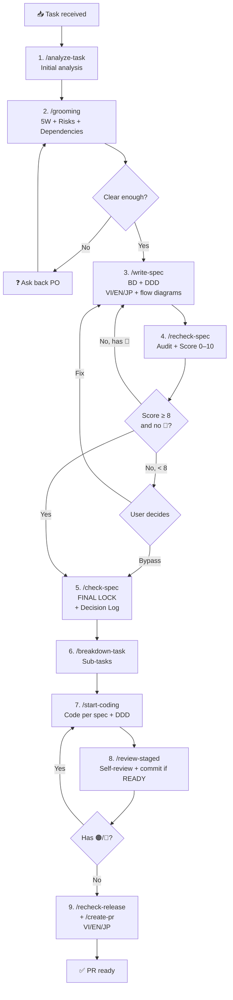

# 🧭 Senior Engineer Workflow

> **EN**: Standard personal workflow — from task intake to merged PR. Applies to every feature / bugfix / refactor.
> **VI**: Workflow chuẩn cá nhân — từ lúc nhận task đến khi merge PR. Áp dụng cho mọi feature / bugfix / refactor.

## 🎯 Goals / Mục tiêu

- Reduce **input ambiguity** → reduce final-stage rework. / Giảm mơ hồ đầu vào → giảm rework cuối.
- Force **think before code**. / Buộc suy nghĩ trước, code sau.
- Document decisions for future onboarding / handover. / Tài liệu hoá quyết định để onboard / handover sau này.

---

## 📐 Overall Flow



---

## 1. `/analyze-task` — Initial analysis / Phân tích sơ bộ

**EN purpose**: Decompose the request before committing.
**VI**: Bóc tách yêu cầu trước khi cam kết.

**Output checklist:**
- [ ] **Summary** (1–2 sentences in your own words / tóm tắt bằng từ của mình)
- [ ] **Why** — real business goal / mục tiêu kinh doanh thật
- [ ] **Scope IN / OUT** (OUT is critical to prevent scope creep)
- [ ] **≥2 approach options** with pros/cons
- [ ] **Impact level**: 🟢 / 🟡 / 🟠 / 🔴
- [ ] **Estimate (Suemori)**: `optimistic | realistic | pessimistic`
- [ ] **Open Questions** for PO

---

## 2. `/grooming` — 5 Whys + Risk + Dependencies

**EN purpose**: Find hidden issues BEFORE writing the spec.
**VI**: Tìm vấn đề ẩn TRƯỚC khi viết spec.

**Required output:**
- 5 Whys → root cause / root goal
- Risk Matrix (Tech / Business / Ops × likelihood × impact × mitigation)
- Dependencies (blocked-by / blocks / external)
- Edge cases (≥5)
- Non-functional requirements (perf / security / scalability / observability / i18n / a11y / compliance)
- Ask-back questions

---

## 3. `/write-spec` — Basic Design + Detail Design

**EN purpose**: Document decisions before coding.
**VI**: Tài liệu hoá quyết định trước khi code.

**Output**: 2 files (each tri-lingual EN / VI / JP):
- `docs/specs/<YYYY-MM-DD>-<slug>.md` — Basic Design (BD)
- `docs/ddd/<YYYY-MM-DD>-<slug>.md` — Detail Design Document (DDD)

**Required diagrams (must include):**
- BD: 1 high-level **flowchart** showing processing flow / sơ đồ luồng xử lý high-level.
- DDD: 1 **flowchart** (logical processing) + 1 **sequence diagram** (happy path) + 1 **sequence diagram** (error path) + (if schema change) 1 **ERD**.

> **Must read**: `.agents/skills/writing-bd/SKILL.md`, `.agents/skills/writing-ddd/SKILL.md`.

### 3b. `/write-spec-ai-housemaker` — ai-housemaker variant (Stage 3)

Use for **ai-housemaker** repo (Rails 7.2 + Hotwire + Tailwind + Preline).

| Output | Language | Path |
|---|---|---|
| BD | Tri-lingual EN/VI/JP | `docs/specs/<YYYY-MM-DD>-<slug>.md` |
| DDD (canonical) | EN only, 15 sections | `docs/ddd/<YYYY-MM-DD>-<slug>.md` |
| DDD (Notion) | Vietnamese only | `docs/ddd/<YYYY-MM-DD>-<slug>.vi.md` |

Templates: `docs/ddd/_TEMPLATE-ai-housemaker.md` (EN), `docs/ddd/_TEMPLATE-ai-housemaker.vi.md` (VI).

Prompt: `.github/prompts/write-spec-ai-housemaker.prompt.md`

---

## 4. `/recheck-spec` — Self-audit with **scoring + level**

**EN purpose**: Critic-mode audit with quantified score.
**VI**: Audit chế độ phản biện, có chấm điểm.

### Pass criteria
- **Score ≥ 8.0 / 10** → APPROVED → `/check-spec`.
- **Score < 8.0** → NOT YET. Recommend back to `/write-spec`.
- **User is final decision-maker** — may bypass < 8 (logged in Decision Log).
- **Absolute hard rule**: any 🔴 Critical → BLOCKED, no bypass.

### 10-item Rubric (each 0 / 0.5 / 1.0)

1. Open Questions resolved
2. Edge cases coverage (≥5)
3. Sequence + flow diagrams (happy + error)
4. API contract completeness (schema + examples + error codes)
5. Migration & rollback (up / down / backfill / steps)
6. Quantitative test plan
7. Observability plan (metrics + logs + traces + alerts)
8. Security considerations
9. Performance budget (p50 / p95 / p99 + throughput)
10. Consistency & clarity

> N/A items → justify in 1 line, pro-rate score × 10 / applied items.

### Severity ↔ Score
| Severity | Effect |
|---|---|
| 🔴 Critical | Item = 0.0 + auto-block, no bypass |
| 🟠 High | Item = 0.0 |
| 🟡 Medium | Item = 0.5 |
| 🟢 Low | No deduction |

---

## 5. `/check-spec` — Final Lock

**5 gates** (all required):
1. ✅ `/recheck-spec` ran with scorecard.
2. ✅ Score ≥ 8.0 OR explicit user bypass logged.
3. ✅ NO 🔴 Critical (always blocks, never bypassable).
4. ✅ Stakeholder sign-off (manual confirm).
5. ✅ Spec files saved on disk (uncommitted OK).

→ Flip `Status: DRAFT` → `Status: FINAL`. Add `Locked at: <ISO>`, `Audit score: X.X / 10`. Append changelog. **No `git commit` in this stage** — see `.cursor/rules/git-commit-policy.mdc`. If bypassed: list open risks + follow-up.

---

## 6. `/breakdown-task` — Split into sub-tasks

- Each sub-task ≤ 4h.
- Each has measurable Definition of Done.
- Priority order: P0 schema/contract → P1 core logic / high-risk → P2 API/integration → P3 UI/glue → P4 polish.
- Mark parallel-able sub-tasks.

---

## 7. `/start-coding` — Implement per spec + DDD plan

**EN purpose**: Code the next sub-task following the FINAL spec exactly.
**VI**: Code sub-task tiếp theo theo đúng spec FINAL.

**Command**: `/start-coding` — run once per sub-task.

### Before typing line 1:
- [ ] Re-read FINAL spec (BD + DDD).
- [ ] Identify which sub-task is next (from Stage 6 breakdown).
- [ ] Read `.cursor/rules/clean-code.mdc` (or `.github/instructions/clean-code.instructions.md`).
- [ ] Read `.cursor/rules/architecture.mdc`.
- [ ] Read relevant `.agents/skills/` (e.g. `design-patterns`).

### For each sub-task:
1. Print sub-task info (title, priority, risk, DoD).
2. Create a brief implementation plan (files, layers, decisions, test approach).
3. Write production code + tests.
4. Verify Definition of Done.
5. Stage changes (`git add`) — **do not commit**.
6. → Run `/review-staged` → commit **only if** READY.

### Repeat cycle:
```
/start-coding → code → stage → /review-staged → commit if READY → next sub-task
```

### Hard rules:
- NEVER deviate from FINAL spec — if change needed, STOP and return to Stage 3.
- NEVER skip tests — every sub-task must have tests matching its DoD.
- **Never commit in Stages 1–6 or in `/start-coding`** — one commit per sub-task after `/review-staged` READY.

---

## 8. `/review-staged` — Self-review staged changes + commit gate

Scope: only staged files (`git diff --cached`).

**When verdict is READY** (no 🔴/🟠): run `git commit` — the **only** allowed commit point in the implementation loop. See `.cursor/rules/git-commit-policy.mdc`.

**8 review dimensions:**
1. Spec compliance (matches DDD?)
2. Clean code & naming
3. Architecture / layer boundaries
4. Error handling & logging
5. Security (input validation, secrets, OWASP top 10)
6. Performance (N+1, big-O, allocation)
7. Test coverage (happy + edge + error paths)
8. Backward compatibility / migration

**4 severity levels:** 🔴 Critical (block) / 🟠 High (must-fix) / 🟡 Medium (should-fix) / 🟢 Low (nitpick).

---

## 9. `/recheck-release` + `/create-pr`

### 9a. `/recheck-release` — Release readiness
6 gate categories: code quality, tests, spec compliance, operational safety, documentation, security. Output `READY ✅` or `BLOCKED ❌` with reasons.

### 9b. `/create-pr` — Tri-lingual PR
- **PR Title**: English (Conventional Commits, ≤72 chars).
- **Squash commit body**: English.
- **PR Description**: 3 collapsible blocks `EN / VI / JP`, all with Why / What / Impact / How to test / Spec / Checklist / Rollback.

### 9c. `/create-release` — Release Summary for Deploy Handoff
- Output format: `Summary` + `No 1..N requirement` + `Command` blocks (when needed).
- Supports language mode: `/create-release (vi)` or `/create-release (en)`.
- Keep section keywords in English for scanability; explanation follows selected mode.

---

## 🔁 When to revert

| Situation | Revert to |
|---|---|
| New edge case mid-implement | Stage 3 |
| PO changes requirements | Stage 2 |
| Review finds 🔴 from design flaw | Stage 3 |
| `/recheck-release` BLOCKED | Depends |

---

## 📎 Slash command index (ordered by workflow)

| # | Command | Stage | When to use | File |
|---|---|---|---|---|
| 1 | `/analyze-task` | 1 | Nhận task mới, phân tích sơ bộ | `.github/prompts/analyze-task.prompt.md` |
| 1b | `/analyze-task-ai-housemaker` | 1 | ai-housemaker — + `development-guideline.mdc` | `.github/prompts/analyze-task-ai-housemaker.prompt.md` |
| 2 | `/grooming` | 2 | Đào sâu 5W, risk, dependencies | `.github/prompts/grooming.prompt.md` |
| 3 | `/write-spec` | 3 | Viết BD + DDD (tri-lingual) | `.github/prompts/write-spec.prompt.md` |
| 3b | `/write-spec-ai-housemaker` | 3 | ai-housemaker: BD tri-lingual + DDD EN + `.vi.md` | `.github/prompts/write-spec-ai-housemaker.prompt.md` |
| 4 | `/recheck-spec` | 4 | Audit spec, chấm điểm /10 | `.github/prompts/recheck-spec.prompt.md` |
| 5 | `/check-spec` | 5 | Lock spec → FINAL | `.github/prompts/check-spec.prompt.md` |
| 6 | `/breakdown-task` | 6 | Chia sub-tasks ≤4h | `.github/prompts/breakdown-task.prompt.md` |
| 7 | `/start-coding` | 7 | Code sub-task theo spec + DDD | `.github/prompts/start-coding.prompt.md` |
| 8 | `/review-staged` | 8 | Self-review staged changes | `.github/prompts/review-staged.prompt.md` |
| 9 | `/recheck-release` | 9a | Kiểm tra release readiness | `.github/prompts/recheck-release.prompt.md` |
| 10 | `/create-pr` | 9b | Tạo PR tri-lingual | `.github/prompts/create-pr.prompt.md` |
| 11 | `/create-release` | 9c (utility) | Tạo release summary cho deploy handoff | `.github/prompts/create-release.prompt.md` |
